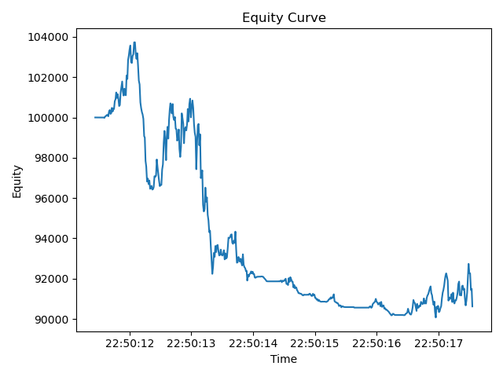

# Backtest Performance Report
## Summary Metrics
| Metric | Value |
|---|---:|
| Total Return | -0.0938 |
| Sharpe (per-period) | -0.0522 |
| Max Drawdown | 0.1317 |

## Equity Curve

## Interpretation
Over the backtest window, total return was -9.38%, with a per-period Sharpe of -0.0522 and a maximum drawdown of 13.17%. The engine recorded 431 filled orders, 49 rejects, and 58 logged errors. 