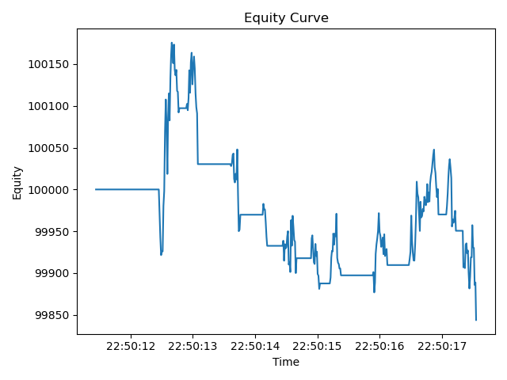

# Backtest Performance Report
## Summary Metrics
| Metric | Value |
|---|---:|
| Total Return | -0.0016 |
| Sharpe (per-period) | -0.0217 |
| Max Drawdown | 0.0033 |

## Equity Curve

## Interpretation
Over the backtest window, total return was -0.16%, with a per-period Sharpe of -0.0217 and a maximum drawdown of 0.33%. The engine recorded 23 filled orders, 1 rejects, and 1 logged errors. 