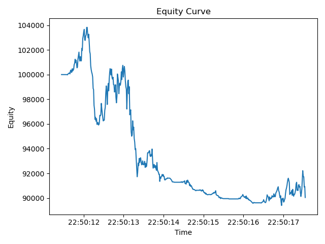

# Backtest Performance Report
## Summary Metrics
| Metric | Value |
|---|---:|
| Total Return | -0.0995 |
| Sharpe (per-period) | -0.0532 |
| Max Drawdown | 0.1389 |

## Equity Curve

## Interpretation
Over the backtest window, total return was -9.95%, with a per-period Sharpe of -0.0532 and a maximum drawdown of 13.89%. The engine recorded 417 filled orders, 46 rejects, and 48 logged errors. 